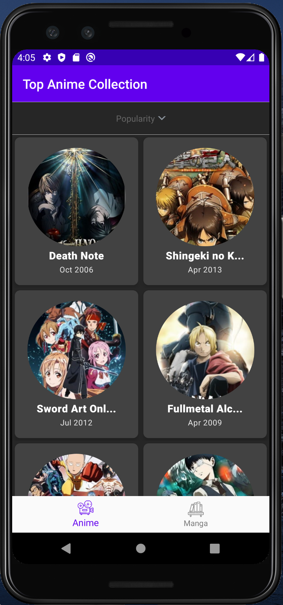
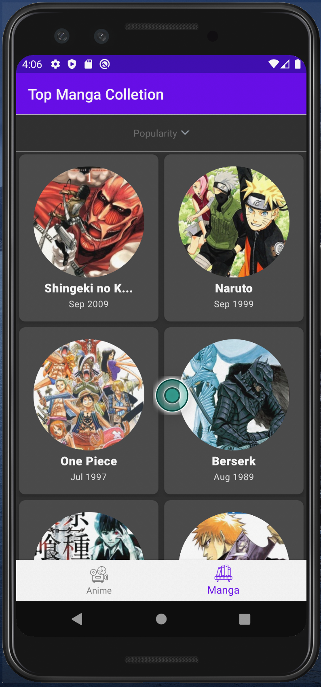
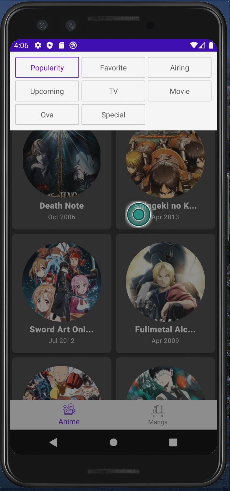
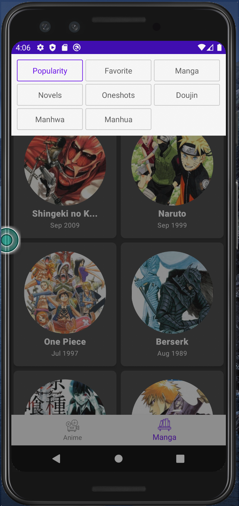
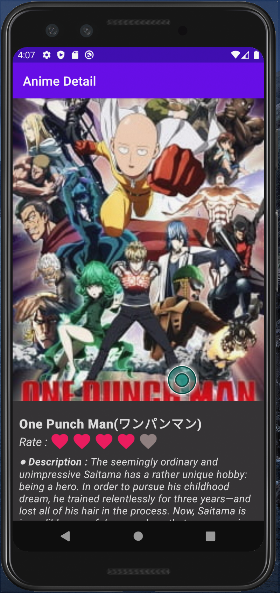
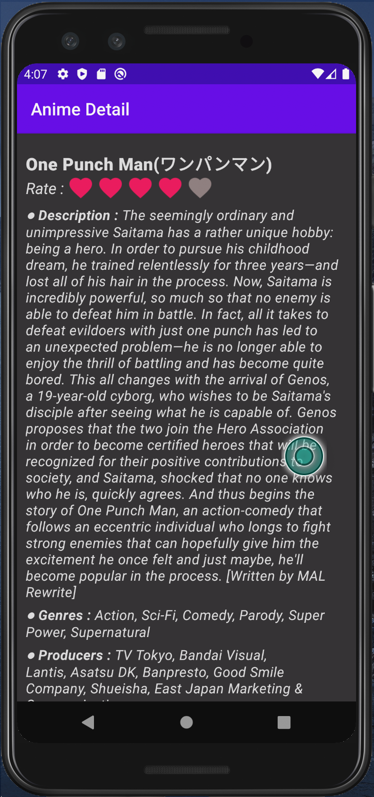
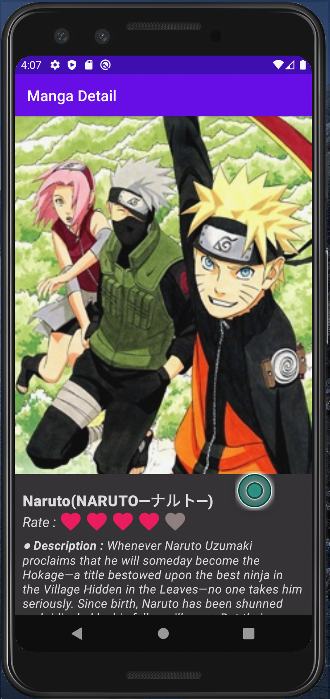
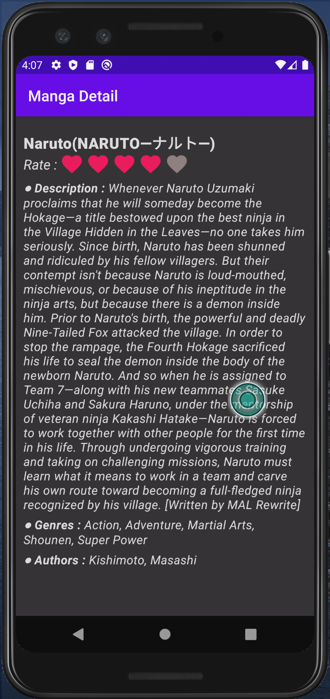

# TopAnimeManga Application
## Purpose : 
I created this application for practicing Android Listview, Gridview and API Request, Response Handling, Fragment
## Using Libraries:
Some libraries which I used in this application:

1. <a href="https://developer.android.com/training/volley">Volley</a> : An HTTP library that makes networking for Android apps easier and most importantly, faster
2. <a href="https://github.com/skydoves/TransformationLayout">TransformationLayout</a> : A library that makes transforms into a different view or activity using morphing animations.
3. <a href="https://github.com/bumptech/glide">Glide</a> : A fast and efficient open source media management and image loading framework for Android that wraps media decoding, memory and disk caching, and resource pooling into a simple and easy to use interface
4. <a href="https://jikan.docs.apiary.io/#reference/0/top">Jikan API</a> : An Unofficial MyAnimeList API. It scrapes the website to satisfy the need for an API - which MyAnimeList lacks.

## Functionalities:
Some functionalities that I developed in this app:

1. Display Top50 Anime, Manga by popularity
2. Filter list anime, manga by category. 
* Anime Categories: Airing, Upcoming, TV, Movie, Ova, Special. 
* Manga Categories: Manga, Novels, Oneshots, Doujin, Manhwa, Manhua 
* Both: Popularity, Favorite

3. View detail info of Anime, Manga (title, japanese title, rating score, description, genres, authors, producers)

## Demo:
Some images that I captured:

Anime List            |   Manga List
:-------------------------:|:-------------------------:
  |  

Anime Category Filter           |   Manga Category Filter
:-------------------------:|:-------------------------:
  |  

Anime Detail           |   Detail Infomations
:-------------------------:|:-------------------------:   
 | 

Manga Detail           |   Detail Infomations
:-------------------------:|:-------------------------:   
 | 

## Video demo: 

